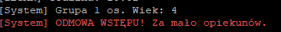
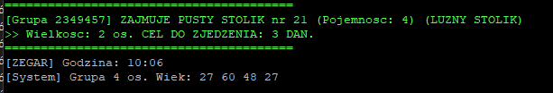
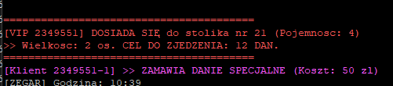
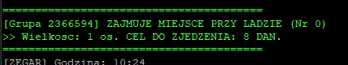
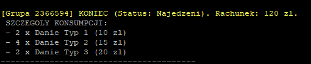
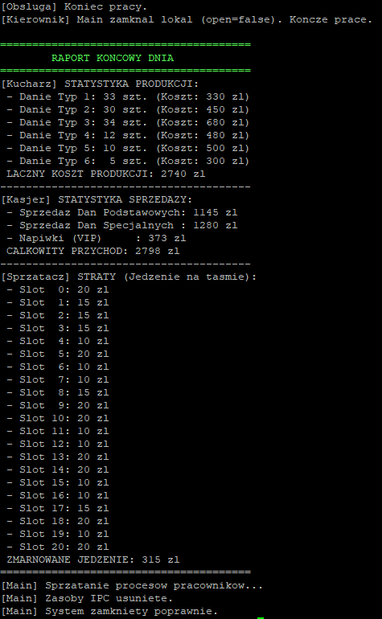

# 🍣 kaiten-zushi

# [LINK DO GITHUB](https://github.com/wiksas/kaiten-zushi)

### Użyty kompilator: TORUS

## Wiktor Sasnal

Zaawansowana symulacja restauracji sushi oparta na architekturze wieloprocesowej oraz mechanizmach komunikacji międzyprocesowej w systemie Linux.


## 📂 Spis treści
- [AUTOR](#autor)
- [TEMAT PROJEKTU](#temat-projektu)
- [INFORMACJE OGÓLNE](#informacje-ogólne)
- [TECHNOLOGIE](#technologie)
- [ARCHITEKTURA IPC](#architektura-ipc)
- [TESTY](#testy)
- [KONFIGURACJA](#konfiguracja)

# AUTOR 

**Wiktor Sasnal**

---

## TEMAT PROJEKTU

**Temat 1 - Restauracja „kaiten zushi”.**

---

## INFORMACJE OGÓLNE
### 1. Założenia projektowe i opis kodu
Celem projektu było stworzenie symulacji restauracji: Kaiten-zushi. Kod został podzielony na moduły: `main` (zarządca), `klient` (logika gości), `kucharz`, `obsługa` i `kierownik`.

### 2. Elementy Dodatkowe
- **VIP i Napiwki:** Implementacja napiwków dla vipów jako dodatkowy przypływ gotówki nieuwzględniony w poleceniu.

---

## TECHNOLOGIE

<p align="center">


</p>

---


## ARCHITEKTURA IPC

### A. Tworzenie i obsługa plików
* [Zapis logów do pliku: common.h](https://github.com/wiksas/kaiten-zushi/blob/main/common.h#L71-L87)

### B. Tworzenie procesów
* [Tworzenie procesu klienta: main.c](https://github.com/wiksas/kaiten-zushi/blob/main/main.c#L152)
* [Uruchamianie programu np.klienta:  main.c](https://github.com/wiksas/kaiten-zushi/blob/main/main.c#L112-L114)
* [Kończenie procesu: klient.c](https://github.com/wiksas/kaiten-zushi/blob/main/klient.c#L76)
* [Oczekiwanie na procesy potomne zombie: main.c](https://github.com/wiksas/kaiten-zushi/blob/main/main.c#L53-L57)

### C. Tworzenie i obsługa wątków
* [Tworzenie wątków osób w grupie: klient.c](https://github.com/wiksas/kaiten-zushi/blob/main/klient.c#L279)
* [Oczekiwanie na wątki: klient.c](https://github.com/wiksas/kaiten-zushi/blob/main/klient.c#L280)
* [Synchronizacja wątków: klient.c](https://github.com/wiksas/kaiten-zushi/blob/main/klient.c#L94-L96)

### D. Obsługa sygnałów
* [Rejestracja obsługi SIGINT/SIGALRM(signal/sigaction): main.c](https://github.com/wiksas/kaiten-zushi/blob/main/main.c#L50)
* [Wysyłanie sygnałów do pracowników(kill): main.c](https://github.com/wiksas/kaiten-zushi/blob/main/main.c#L33-L35)

### E. Synchronizacja procesów
* [Inicjalizacja zestawu semaforów (semget/semctl): main.c](https://github.com/wiksas/kaiten-zushi/blob/main/main.c#L99)
* [Operacje na semaforach (semop - funkcja pomocnicza): common.h](https://github.com/wiksas/kaiten-zushi/blob/main/common.h#L91-L97)

### F. Pamięć dzielona
* [Utworzenie segmentu pamięci (shmget): main.c](https://github.com/wiksas/kaiten-zushi/blob/main/main.c#L59)
* [Dołączenie pamięci do przestrzeni adresowej (shmat): main.c](https://github.com/wiksas/kaiten-zushi/blob/main/main.c#L61)
* [Usunięcie segmentu (shmctl IPC_RMID): main.c](https://github.com/wiksas/kaiten-zushi/blob/main/main.c#L39)

### G. Kolejki komunikatów
* [Utworzenie kolejki (msgget): main.c](https://github.com/wiksas/kaiten-zushi/blob/main/main.c#L110)
* [Wysłanie zamówienia specjalnego (msgsnd IPC_NOWAIT): klient.c](https://github.com/wiksas/kaiten-zushi/blob/main/klient.c#L89)
* [Odbiór zamówienia przez kucharza (msgrcv): kucharz.c](https://github.com/wiksas/kaiten-zushi/blob/main/kucharz.c#L45)


Implementacja struktur `IPC` dla zasady zadania projektowego

### 1. Pamięć Współdzielona
Wspólny obszar pamięci przechowuje stan świata dostępny dla wszystkich procesów:

> **Link do kodu (implementacja):**
> [Kliknij tutaj, aby zobaczyć kod](https://github.com/wiksas/kaiten-zushi/blob/main/main.c#L59-L61)

### 2. Semafory
System wykorzystuje zestaw **8 semaforów** do sterowania dostępem i synchronizacji:

| ID | Rola | Opis działania |
| :--- | :--- | :--- |
| **0** | **Mutex Taśmy** | Binarny (0/1). Blokuje dostęp do edycji taśmy podczas nakładania/zdejmowania dań. |
| **1** | **Sygnał Kucharza** | Kucharz oczekuje na tym semaforze (wartość 0). Klient podbija go (+1), by zlecić zamówienie. |
| **2** | **Licznik 2-os** | Sem. licznikowy dla stolików 2-osobowych. |
| **3** | **Licznik 3-os** | Sem. licznikowy dla stolików 3-osobowych. |
| **4** | **Licznik 4-os** | Sem. licznikowy dla stolików 4-osobowych. |
| **5** | **Mutex Kasjera** | Binarny (0/1). Zapewnia atomowość operacji dodawania utargu do statystyk globalnych. |
| **6** | **Licznik Lady** | Sem. licznikowy dla Lady. |
| **7** | **Licznik 1-os** | Sem. licznikowy dla stolików 1-osobowych. |

> **Link do kodu (implementacja):**
> [Kliknij tutaj, aby zobaczyć kod](https://github.com/wiksas/kaiten-zushi/blob/main/main.c#L99-L108)

### 3. Kolejki Komunikatów
* **Cel:** Obsługa asynchronicznych Zamówień Specjalnych.
* **Działanie:** Klient wysyła strukturę `SpecialOrder`.

> **Link do kodu (implementacja):**
> [Kliknij tutaj, aby zobaczyć kod](https://github.com/wiksas/kaiten-zushi/blob/main/klient.c#L83-L89)

### 4. Wątki
* **Kontekst:** Działają wewnątrz procesu `./klient`.
* **Rola:** Symulują poszczególne osoby w grupie siedzące przy jednym stoliku.
* **Synchronizacja:** `pthread_mutex_t group_lock` chroni wspólny rachunek grupy oraz licznik zjedzonych posiłkow.

> **Link do kodu (implementacja):**
> [Kliknij tutaj, aby zobaczyć kod](https://github.com/wiksas/kaiten-zushi/blob/main/klient.c#L128-L142)


## TESTY

Poniżej przedstawiono zestawienie testów weryfikujących kluczowe funkcjonalności systemu. Każdy test opatrzony jest dowodem działania.

### T1: Weryfikacja Opieki nad Dziećmi (Odmowa Wstępu)
* **Cel:** Sprawdzenie, czy system blokuje wejście grupie, która nie spełnia wymogu opieki (minimum 1 dorosły na każde rozpoczęte 3 dzieci).
* **Scenariusz:** Uruchomienie grupy , w której losowanie przydzieliło same dzieci (wiek < 10 lat).
* **Oczekiwany Rezultat:**
  1. Program wypisuje czerwony komunikat: `[System] ODMOWA WSTĘPU! Za mało opiekunów.`
  2. W komunikacie widać szczegóły grupy (wiek uczestników).
  3. Proces klienta kończy się natychmiast (`exit(0)`) i nie zajmuje zasobów.

> **Dowód działania:**
>
> 

---

### T2: Logika Współdzielenia Stolików
* **Cel:** Sprawdzenie, czy semafory i algorytm wyszukiwania pozwalają na dosiadanie się grup do częściowo zajętych stolików.
* **Scenariusz:**
  1. Do stolika 4-osobowego (np. o indeksie 21) siada pierwsza grupa 2-osobowa.
  2. Wchodzi kolejna grupa 2-osobowa, która wylosuje ten sam typ stolika/strefę.
* **Oczekiwany Rezultat:**
  1. Druga grupa otrzymuje ten sam numer stolika co pierwsza (np. nr 21).
  2. Pojawia się komunikat: `DOSIADA SIĘ do stolika nr 21`.
  3. Obie grupy jedzą równolegle, a zajętość stolika w pamięci współdzielonej wynosi 4/4.

> **Dowód działania:**
>
> 
> 

---


### T3: Weryfikacja Celu Konsumpcji
* **Cel:** Sprawdzenie, czy klient poprawnie realizuje cykl życia: jedzenie -> osiągnięcie celu -> zwolnienie stolika.
* **Scenariusz:** Klient otrzymuje losowy cel zjedzenia dań (zmienna `target_to_eat`, np. 8 dań).
* **Oczekiwany Rezultat:**
  1. W logu startowym widać: `>> Wielkosc: X os. CEL DO ZJEDZENIA: 8 DAN.`
  2. Klient zjada dokładnie tyle dań.
  3. W komunikacie końcowym widnieje status `Najedzeni` oraz poprawna kwota rachunku.

> **Dowód działania:**
>
> 
> 

---

### T4: Poprawność Raportu Finansowego
* **Cel:** Weryfikacja, czy proces `Main` poprawnie sumuje przychody ze wszystkich źródeł (sprzedaż standardowa, specjalna, napiwki).
* **Scenariusz:** Symulacja z udziałem klientów VIP (dających napiwki) oraz zwykłych klientów.
* **Oczekiwany Rezultat:**
  1. sumy się zgadzają.
  2. Równanie: `Sprzedaż Dań Podstawowych` + `Sprzedaż Dań Specjalnych` + `Napiwki` = `CAŁKOWITY PRZYCHÓD`.

> **Dowód działania:**
>
> 


---

## KONFIGURACJA  
### Użyty kompilator: TORUS
To run this project:
### 1. Kompilacja modułów
Projekt można skompilować ręcznie przy użyciu poniższych komend:

```bash
# Sklonuj repozytorium
git clone https://github.com/wiksas/kaiten-zushi.git
cd kaiten-zushi

# Kompilacja ról systemowych
gcc kucharz.c -o kucharz
gcc obsluga.c -o obsluga
gcc kierownik.c -o kierownik

# Klient wymaga biblioteki pthread
gcc klient.c -o klient -lpthread

# Główny program
gcc main.c -o main
```

lub

```bash
# Sklonuj repozytorium
git clone https://github.com/wiksas/kaiten-zushi.git
cd kaiten-zushi

make

./main
```


# Uruchom symulację: `./main`.

### Krok 2: Wysyłanie poleceń
W nowym oknie terminala wyślij odpowiedni sygnał:

| Akcja | Sygnał | Komenda terminala |
| :--- | :--- | :--- |
| **Przyspieszenie** | SIGUSR1 | kill -USR1 <PID_KIEROWNIKA> |
| **Spowolnienie** | SIGUSR2 | kill -USR2 <PID_KIEROWNIKA> |
| **Ewakuacja / Wyjście** | SIGALRM | kill -ALRM <PID_KIEROWNIKA> |

[Portfolio](https://wiksas.github.io/UIPortfolio/)
